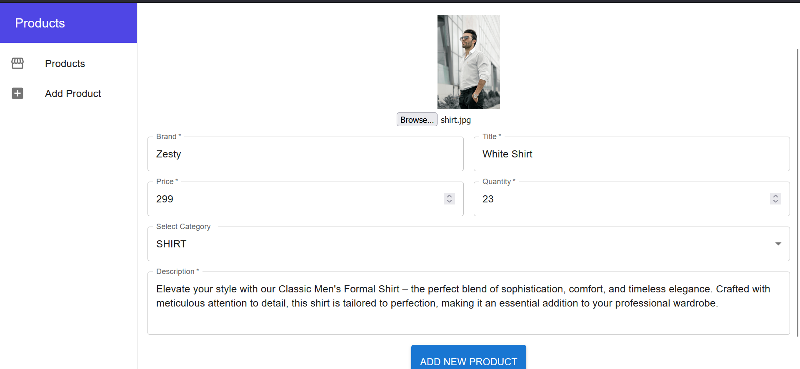
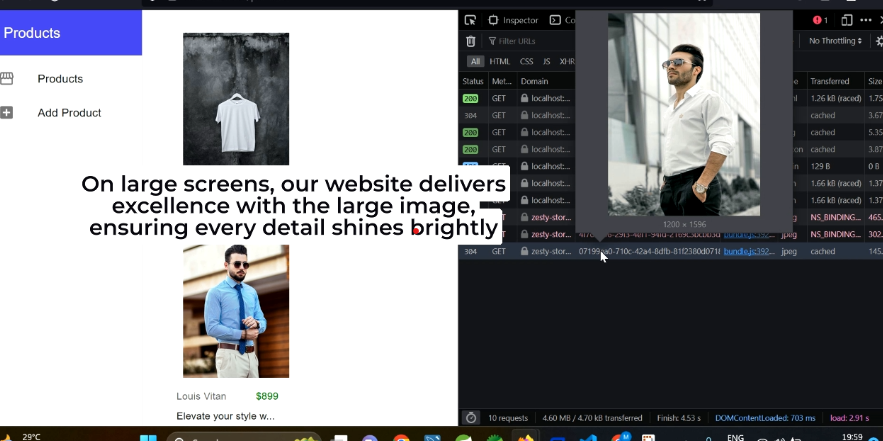
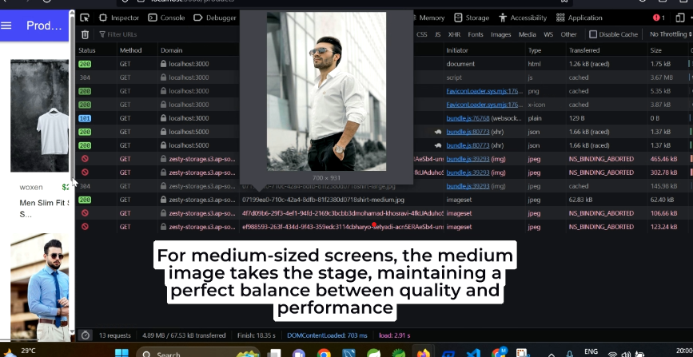

# Responzive ImageMaster: Spring Boot, React, AWS S3, Thumbnailator

Responsive Image Handling with Spring Boot, React, Redux, Thumbnailator and AWS S3

## Project Description

This project demonstrates how to efficiently handle and serve responsive images using Spring Boot for the backend, React and Redux for the frontend, AWS S3 for image storage, and Thumbnailator for image resizing.

## Project Demo Video


https://github.com/qasimk02/s3-file-upload/assets/97465350/e49d4436-4745-4d23-97d8-5b90ccbb7545


## Table of Contents

- [Technologies Used](#technologies-used)
- [Installation](#installation)
- [Usage](#usage)
- [Image Resizing Approach](#image-resizing-approach)
- [Uploading to AWS S3](#uploading-to-aws-s3)
- [Screenshots](#screenshots)
- [Contributing](#contributing)
- [Contact Information](#contact-information)

## Technologies Used

- 
- 
- 
- 
- 


## Installation

To set up this project locally, follow these steps:

1. Clone the repository.
2. Install the necessary dependencies for the backend and frontend.
3. Configure your AWS S3 credentials.
4. Start both the Spring Boot backend and React frontend.

Detailed installation instructions can be found in the respective project directories.

## Usage

This project provides a responsive image handling solution for different screen sizes. In the frontend, you can use the `responsiveImages` function to serve images based on screen width.

```jsx
// This function, responsiveImages, takes the `imageName` and `productId` obtained from the backend 
// and generates an HTML `img` element with responsive image sources based on screen size.
// It constructs the image URLs using the provided AWS_S3_BASE_URL and the image's base name and extension.
// The `srcSet` attribute specifies different image sources for various screen widths,
// and the `sizes` attribute sets the maximum image width for each source.
const responsiveImages = (imageName, productId) => {
  const imageBaseName = imageName.substring(0, imageName.lastIndexOf("."));
  const extension = imageName.substring(imageName.lastIndexOf(".") + 1);

  return (
    
  );
};

```
In the backend we used thumbnailtor to generate multiple size compressed images and uploaded it on `AWS S3`.

## Backend Image Processing (Spring Boot)

In this project, we've implemented a backend service in Spring Boot to handle image processing and uploading to AWS S3. This process ensures that responsive images are available for different screen sizes on the frontend.

### Image Resizing Approach

The `uploadFile` method takes an uploaded image file (`MultipartFile`), a product ID (`id`), a folder (`folder`), and a file name (`fileName`) as parameters. It performs the following steps:

1. Extracts the base name and extension of the `fileName`.

2. Resizes the image into three sizes: small, medium, and large, using the `resizeImageToBytes` method.

3. Calls the `uploadToS3` method to upload each resized image to AWS S3. It constructs the S3 key (path) based on the `id`, `folder`, and image size.
4. The `resizeImageToBytes` method takes the original image file (`MultipartFile`), desired `width`, `ratio`, and `quality` parameters. It uses the Thumbnailator library to perform the following tasks:

      1. Resize the image while maintaining the specified aspect ratio and quality.
      
      2. Write the resized image to an `outputStream`.
      
      3. Return the byte array representing the resized image.

```java
public String uploadFile(MultipartFile file, Long id, String folder, String fileName) {

		String baseName = fileName.substring(0, fileName.lastIndexOf("."));
		String extension = fileName.substring(fileName.lastIndexOf(".") + 1);

		// Small image
		byte[] smallImage = resizeImageToBytes(file, 300, (1.33), 0.8);
		uploadToS3(smallImage, folder + "/" + id + "/" + baseName + "-small." + extension);

		// Medium image
		byte[] mediumImage = resizeImageToBytes(file, 700, (1.33), 0.8);
		uploadToS3(mediumImage, folder + "/" + id + "/" + baseName + "-medium." + extension);

		// Large image
		byte[] largeImage = resizeImageToBytes(file, 1200, (1.33), 0.8);
		uploadToS3(largeImage, folder + "/" + id + "/" + baseName + "-large." + extension);

		return "File uploaded succesfully " + fileName;
	}

private byte[] resizeImageToBytes(MultipartFile file, int width, double ratio, double quality) {
		ByteArrayOutputStream outputStream = new ByteArrayOutputStream();
		try {
			System.out.println((int)(width*ratio));
			Thumbnails.of(file.getInputStream()).forceSize(width, (int)(width*ratio)).outputQuality(quality)
					.toOutputStream(outputStream);
		} catch (Exception ex) {
			log.error("Error resizing the image", ex);
		}
		return outputStream.toByteArray();
	}
```

### Uploading to AWS S3

The `uploadToS3` method takes the resized image data (`fileBytes`) and the desired file name (`fileName`) for the AWS S3 object. It performs the following steps:

1. Creates a `PutObjectRequest` specifying the target AWS S3 bucket and object key (file path).

2. Uses the AWS S3 client (`s3Client`) to upload the object to AWS S3.

```java
// upload to s3
	private String uploadToS3(byte[] fileBytes, String fileName) {
		PutObjectRequest objectRequest = PutObjectRequest.builder().bucket(bucketName).key(fileName).build();
		s3Client.putObject(objectRequest, RequestBody.fromBytes(fileBytes));
		return "File Uploaded Succesfully " + fileName;
	}
```

This backend code efficiently processes and optimizes images for responsive display on the frontend, ensuring that the appropriate image sizes are available for different screen widths.

Please make sure to configure your AWS S3 bucket and credentials as well as the Thumbnailator library for proper image processing.

## Screenshots
<p align="center">
  
<p align="center">
  
</p>
<p align="center">
  
</p>
<p align="center">
  
</p>


## Contributing
We welcome contributions to Sercuit! To contribute, follow these steps:

1. Fork the repository.
2. Create a new branch: `git checkout -b feature/[feature-name]`
3. Make your changes and commit them: `git commit -m "Add new feature"`
4. Push to the branch: `git push origin feature/[feature-name]`
5. Submit a pull request to the `develop` branch.
---

## Contact Information

If you have any questions, suggestions, or need further assistance, please don't hesitate to reach out to us. We'd be happy to help!

- **MOHAMMAD QASIM**: 
  - Email: [qasiim51@gmail.com](mailto:qasiim51@gmail.com)
  - LinkedIn: [Mohammad Qasim](https://www.linkedin.com/in/mohammad-qasim-9ba96120a/)

Feel free to contact us via email or connect with us on LinkedIn. We value your feedback and inquiries, and we're here to assist you.


Feel free to contact us via email, and we'll get back to you as soon as possible. Your feedback and inquiries are important to us.

<p align="center">
  Made with ❤️ by <a href="https://github.com/qasimk02">Mohammad Qasim</a>
</p>
